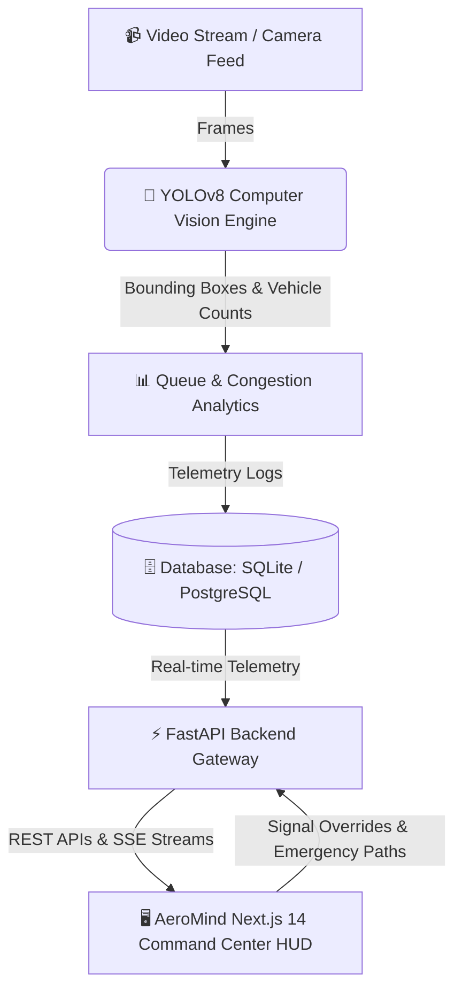

<div align="center">

# 🚦 AeroMind Traffic Center

### *Next-Generation AI-Powered Smart City Intelligent Traffic Management System (ITMS)*

[](https://nextjs.org/)
[](https://fastapi.tiangolo.com/)
[](https://docs.ultralytics.com/)
[](https://tailwindcss.com/)
[](https://www.docker.com/)
[](https://www.python.org/)
[](LICENSE)

---

**AeroMind Traffic Center** is an enterprise-grade Smart City command platform designed to mitigate urban traffic congestion, minimize emergency response latency, and dynamically optimize traffic flow using computer vision, predictive telemetry algorithms, and real-time signal control.

</div>

---

## 🌟 Key Capabilities

- **📷 AI Computer Vision Analytics**: Real-time object detection using **Ultralytics YOLOv8** and OpenCV to classify vehicles (cars, motorcycles, buses, trucks), measure lane density, and compute queue propagation metrics.
- **🚥 Adaptive Signal Control**: Dynamic prioritization engine that calculates optimal green-light cycles based on vehicle density, waiting time metrics, and node propagation vectors.
- **🚑 Emergency Preemption (Green Corridors)**: One-click emergency corridor activation enabling rapid priority routing for ambulances, fire trucks, and police units across city intersections.
- **🔮 Predictive Congestion Analytics**: Forecasting engine offering 5, 15, and 30-minute predictive bottleneck models to assist city operators in proactive traffic management.
- **🗺️ Interactive City Grid Radar**: Dark-themed command HUD with connection integrity diagnostics, radar node overlays, dynamic flow vectors, and animated corridor lines.
- **🔒 Role-Based Access Control (RBAC)**: Fine-grained access clearance powered by JWT authentication (Admin, Traffic Operator, Viewer).

---

## 🧱 System Architecture



---

## 🛠️ Tech Stack & Technologies

### Frontend
- **Framework**: [Next.js 14](https://nextjs.org/) (React 18, TypeScript, App Router)
- **Styling**: [Tailwind CSS](https://tailwindcss.com/) + Custom Glassmorphism Theme
- **Data Visualization**: [Recharts](https://recharts.org/)
- **Icons**: [Lucide React](https://lucide.dev/)

### Backend
- **API Framework**: [FastAPI](https://fastapi.tiangolo.com/) (Python 3.10+)
- **ASGI Server**: [Uvicorn](https://www.uvicorn.org/)
- **ORM & Database**: SQLAlchemy with SQLite (Default) / PostgreSQL (Docker Container)
- **Computer Vision & AI**: OpenCV, Ultralytics YOLOv8, NumPy, PyJWT Authentication

### DevOps & Deployment
- **Containerization**: Docker & Docker Compose
- **Server Platform**: Multi-container stack with health checks & environment isolation

---

## 🔐 System Access Credentials & Clearance

AeroMind Traffic Center incorporates multi-tier Role-Based Access Control (RBAC):

| Role | Username | Password | Access Level & System Capabilities |
| :--- | :--- | :--- | :--- |
| **Admin** | `admin` | `adminpassword` | Full system clearance: Intersection configuration, user administration, override settings. |
| **Traffic Operator** | `operator` | `operatorpassword` | Operational clearance: Trigger emergency green corridors, run YOLO video analysis, signal overrides. |
| **Viewer** | `viewer` | `viewerpassword` | Read-only clearance: Real-time telemetry monitoring, radar view, and metric lookups. |

---

## 📁 Repository Structure

```
AeroMind-Traffic-Center/
├── backend/
│   ├── app/
│   │   ├── api/             # REST API routes (auth, traffic, network, analytics)
│   │   ├── core/            # Config, security JWT, database engine
│   │   ├── models/          # SQLAlchemy database models
│   │   ├── services/        # YOLOv8 processor, signal logic, preemption engine
│   │   └── main.py          # FastAPI application entry point
│   ├── Dockerfile           # Backend container definition
│   └── requirements.txt     # Python dependencies
├── frontend/
│   ├── src/
│   │   ├── app/             # Next.js App Router page layouts and main HUD
│   │   └── components/      # Reusable HUD panels (Radar, Signals, Emergency, Analytics)
│   ├── Dockerfile           # Frontend container definition
│   └── package.json         # Node.js dependencies
├── docker-compose.yml       # Docker orchestrator configuration
├── traffic.db               # Pre-seeded local SQLite database
└── README.md                # System documentation
```

---

## 🚀 Quick Start Guide

### Prerequisites
- [Docker & Docker Compose](https://www.docker.com/products/docker-desktop/) **or**
- [Node.js 18+](https://nodejs.org/) & [Python 3.10+](https://www.python.org/)

---

### Option A: Launch with Docker Compose (Recommended)

Run the complete multi-container stack (Next.js frontend, FastAPI backend, PostgreSQL database) with a single command:

```bash
# 1. Clone the repository
git clone https://github.com/Vanshikarwt/Traffic_system.git
cd Traffic_system

# 2. Build and start services
docker-compose up --build
```

Access the system services:
- 🖥️ **Command Center Dashboard**: `http://localhost:3000`
- ⚡ **FastAPI Interactive Docs (Swagger)**: `http://localhost:8000/docs`

---

### Option B: Local Manual Setup

#### 1. Backend Server Setup

```bash
cd backend

# Create & activate virtual environment
python -m venv venv

# Windows (PowerShell)
.\venv\Scripts\Activate.ps1
# Linux / macOS
source venv/bin/activate

# Install dependencies
pip install -r requirements.txt

# Start FastAPI server
uvicorn app.main:app --reload --host 127.0.0.1 --port 8000
```

#### 2. Frontend Application Setup

```bash
# Open a new terminal
cd frontend

# Install Node modules
npm install

# Start Next.js development server
npm run dev
```

Open `http://localhost:3000` in your browser.

---

## 🔌 API Endpoints Reference

The FastAPI backend exposes comprehensive endpoints documented via OpenAPI at `http://localhost:8000/docs`:

| Method | Endpoint | Description | Clearance Required |
| :---: | :--- | :--- | :---: |
| `POST` | `/api/v1/auth/login` | Authenticate user credentials and return JWT bearer token. | None |
| `GET` | `/api/v1/health` | Perform system health check and database ping. | None |
| `GET` | `/api/v1/intersections` | Retrieve telemetry metrics for registered city intersections. | None |
| `POST` | `/api/v1/intersections` | Register new city intersection node. | **Admin** |
| `POST` | `/api/v1/intersections/{id}/process` | Upload traffic video feed for YOLOv8 inference processing. | **Traffic Operator** |
| `GET` | `/api/v1/intersections/{id}/signal-state` | Compute dynamic green light timing allocation. | None |
| `GET` | `/api/v1/network/grid-telemetry` | Fetch active city grid vector telemetry and flow states. | None |
| `POST` | `/api/v1/network/green-corridor` | Compute shortest path & trigger emergency green corridor preemption. | **Traffic Operator** |
| `GET` | `/api/v1/analytics/forecast/{id}` | Retrieve 5/15/30-minute predictive congestion analytics. | None |

---

## 🎮 Simulation Mode & Demo Video Analytics

If live camera feeds are not connected, **AeroMind Traffic Center** seamlessly runs an internal **High-Fidelity Simulation Engine**. The simulator generates real-time congestion shifts, queue fluctuations, and incoming vector movements, enabling comprehensive testing of signal adjustments and emergency preemption flows.

---

<div align="center">

Developed for modern Smart Cities & Next-Generation Traffic Control Command Hubs.

© 2026 AeroMind Traffic Center — Built with ❤️ for intelligent mobility.

</div>
